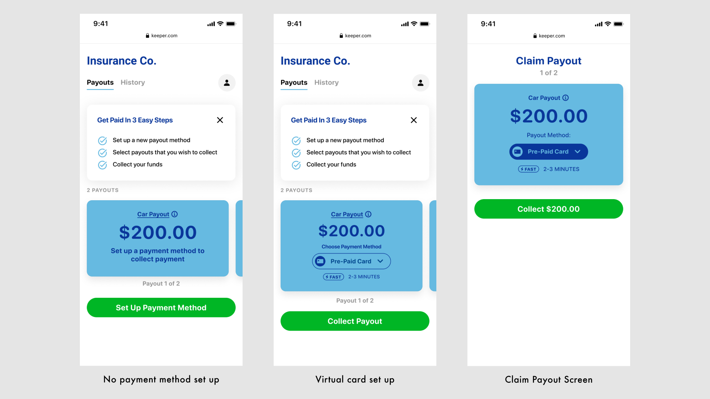
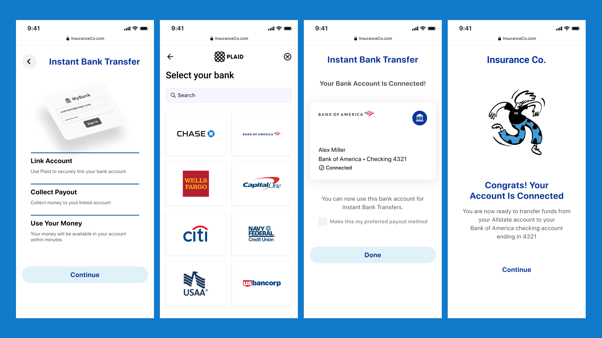

<MdxLayout col='8' offset='4'>

### Timeline: 2 Weeks

__wk 1:__ Become familiar with the client’s existing experience and challenges; design an improved experience; Review designs with client leadership team.

__wk 2:__ Execute changes from previous review; Final review with leadership team.

</MdxLayout>

<MdxLayout col='8' offset='4'>

### Early Results
 
The the new design is showing early signs of success. A higher percentage of users are successfuly competing the new payment set-up flow and are collecting payouts using fast payment methods. The designs were recently shown at the Money 2020 conference and have helped the company win deals with new clients.
 
The the new design is showing early signs of success. A higher percentage of users are successfuly competing the new payment set-up flow and are collecting payouts using fast payment methods. The designs were recently shown at the Money 2020 conference and have helped the company win deals with new clients.

</MdxLayout>

---

<MdxLayout col='4' offset='0'>

## Evaluation of Existing Flow

</MdxLayout>

<MdxLayout col='8' offset='0'>

### Initial KPIs

The client team was seeing that users of their existing flow were abandoning the set-up flow for faster payout methods, instead, keeping check payments as their default.

Most users would never even start the setup flow for a new payment method. The majority of users who did start the flow, would abandon it after only 1 step.

</MdxLayout>

<MdxLayout col='12' offset='0'>

</MdxLayout>

<MdxLayout col='4' offset='0'>
    <figcaption>A few mock-ups the client provided for their original experience. In the middle screen, detailed claim data pushes important calls-to-action below the fold.</figcaption>
</MdxLayout>

<MdxLayout col='8' offset='4'>

### Heuristic Evaluation

There were a few stand-out issues with the existing flow which I hypothesized were contributing to the outcomes above:

> #### Poor information architecture: 
>
> - The design, which was intended to be used on mobile was much too dense
> - The order in which information was presented to the user did not map to the actions they were being asked to take.
> - There was little visual hierarchy to help users process and prioritize. 
> - Calls-to-action were not obvious or clear

> #### Misalignment to understanding user mindset  
>
> - Users of this product are individuals collecting money from an insurance claim, and are likely under unusual stress. Past research experience I’ve had in similar domains lead me to believe that users of this product may forego getting their money faster if that process introduces ambiguity or confusion. They want to know exactly what’s happening with their money

</MdxLayout>

<MdxLayout col='8' offset='4'>

### Design Principles 

Moving toward a solution, I gave myself some principles to aim for:
- Use clear and actionable language 
- Make navigation obvious and simple
- Mobile first
- Can be re-branded in a pinch

</MdxLayout>

---

<MdxLayout col='4' offset='0'>

## Concept Development

</MdxLayout>

<MdxLayout col='8' offset='0'>

### Crafting a challenging, high-friction use case

Knowing we had a rapid timeline, I wanted to explore the most complexity in a short time. So, I began working toward a solution by considering which typical use case would present the most friction to a user, and starting my designs from there.

Working with the product team I decided to focus on a new user to the platform, who had more than one claim with payouts available. 

This user would need to select and set-up a payment method to receive money from a claim, and then execute the payout to that payment method. By showing a user with multiple claims I was able to explore methods for allowing a user to set up multiple payment methods in the case they may want to accept separate payouts using separate payment methods.

### High-level flows

#### Notification

- User is informed they have a payout to claim

#### Onboarding 

- “why am I here”: You have money you can collect
- “what do I need to do?”: Tell us how you want your money 
- “I still don't understand”: There’s help and support built in

#### Payment Method Set Up

- __Present:__ let the user choose a payment method
- __Educate:__ explain at a high level what they chose
- __Validate:__ collect and validate necessary information to set up this method
- __Confirm:__ Present the details again and ask for confirmation

#### Cash Out

- user collects money using the payment method they just set up

I arrived at this flow after exploring several options and reviewing them with other designers on the team. Ultimately I felt this flow did the beset job of orienting the user to the task.

## Early Mocks

Below are some early explorations that I evolved over the course of the sprint.

### Landing Page

an early concept I explored for the landing page using horizontally scrolling cards to represent available payments in a visually bold way to draw the users attention more clearly to the part of the experience with the most value to them. This concept would also make it easier for a user to set a unique payment method to distinct payouts.

### Payout Card During Claim Payout

### Payment Method Selection

I initially explored a list view for the payment selection screen, but using a carousel of cards allowed for more information to be presented to the user. It also helps returning users distinguish between choosing a type of payment to set up from a specific payment method, once set-up.

## Final Delivery

### Scenario
 
Alex, a customer of Insurance Co. has two claim payouts available.
They have never claimed a payout before, and so are a new user to the payouts platform. 

The user will need to log-in and set up at least one new payment method in order to get their money.

Here, the user sets up a virtual card to collect their first payment, and then decides to use an instant bank transfer to collect their second payment.

### Notification
 
Alex receives an email from Insurance Co. telling her that her claims have been approved and she has 2 payouts available.

When a payment becomes available to a user, they receive an email notification. I designed a clear and concise template for an email that quickly demonstrates value to the user and has a clear call to action.

### Onboarding
 
As a new user to the payouts platform, once she logs in, Alex gets some information about this new part of the Insurance Co. site, and what she is about to do.

I designed a 3-page carousel to orient the user to the process they are about to begin, introduce them to the concept of setting up a payment method, and assure them that help and support will be available should they need it.

### Main Screen

On the main screen, Alex first sees a card with another brief explanation of what she needs to do to get her money.

Below that is a prominent call-to-action to set up a new payment method, and below that are the details of the payments available to her. If she tapped “collect” on the payment card at this point, it would taker her to the same place as tapping “Set Up Payment Method”

Tapping “see details” on the payment card would bring her to a screen with all of the technical details related to that insurance claim. At the bottom of this screen Alex can get help from the insurance company if she has questions, and if her question is about this specific claim, all of the relevant information is passed along to the support agent.
Support available on claim detail

I tried to make the landing screen as clear and helpful as possible. The previous landing page had a lot of extraneous information exposed, and there were many different paths a user could take to being the flow.

My goal with the design was to move information that was not critical to this flow – such as  details of the insurance claim – to a lower level, and to funnel the user into starting the payment set-up process.

### New Payment Method Selection

When Alex taps the “Set Up Payment Method” button, she is brought to the view below, where she can choose the way she’d like to receive her money, and begin the set up process. 

She has five options available to her:

- get her money on an instantly issued virtual pre-paid card
- instantly transfer funds to a debit card 
- instantly link a bank account to transfer funds to
- use routing and account numbers to initiate an ACH transfer to a bank account
- request a mailed check

My goal was to communicate these potentially hard to understand options in a concise and human way, while emphasizing the value of each option in terms of the time it would take the user to have access to their money.

Going with a carousel of cards instead of a list allows for more information to be given to the user on payment methods that may be unfamiliar to them.

### Set-Up First Payment Method

Alex chooses the first option, virtual card. She first sees a screen outlining the steps to set up this option.

Next, she confirms her personal information on file with Insurance Co., and proceeds to issue a new virtual card.

Once issued, she sees a representation of her new card, a check-box indicating that this can be made her default payment method, and the ability to add the card to the digital wallet on her phone. 

If she taps “done” she gets a final screen reminding her of what she's just done. 

The flows to set up each method vary in the information needed from the user, and number of steps but I created a few key screens that would be present in each flow:

- an intro screen describing what’s about to happen
- a confirmation screen showing the details of the payment method in a consistent way
- a congrats screen to add a moment of lightness and transition the user into the next phase of the flow

### Claim first payout

Now that Alex has set up a payment method, she is brought to this screen where her first claim payout is displayed with the new virtual card applied to it. She can now collect the money for this claim on the virtual card.

### Claim next payout & change payment method

Because Alex has more than one payout available, she is prompted to claim her next payout after successfully claiming the first. 

By default, the last payment method she set up – the virtual card – is applied to this payout. However, by tapping the pill showing the payment method, she exposes a bottom drawer containing the list of her existing payment methods, as well as a button to add a new payment method. 

She chooses to tap this button, and is brought back to the carousel, where she now chooses to set up an Instant Bank Transfer.

After linking her account, she is brought back to the payout screen with this payment method now applied. She claims the payment and returns home.

From the home screen she can view her payment history and manage the different payment methods she’s set up.

## Conclusion

The the new design is showing early signs of success. A higher percentage of users are successfully competing the new payment set-up flow and are collecting payouts using fast payment methods. The designs were recently shown at the Money 2020 conference and have helped the company win deals with new clients.

If I were to continue working on this, I’d like to explore accessibility more deeply by testing with keyboard-only users, or low-sighted users to continue to refine the designs. 

I’d also explore refining and documenting design patterns systematically, so that as the team had a consistent and evolving pattern-set to draw on for new features.

From a product perspective there are other interesting challenges to consider moving forward. The client will be offering this product to different types of insurance companies who’s customers may have slightly different needs. It would be interesting to explore how this offering could be made configurable for different insurance companies and explore how the UI could vary to support different end-user needs, while maintaining the same general component parts.

Overall, I found this project to be fun and challenging practice in rapid iteration and concept-ing. On principle, this project was exciting because it’s a great example of taking something typically seen as a utility and turning it into an experience that has clear benefit for the end-user.

</MdxLayout>