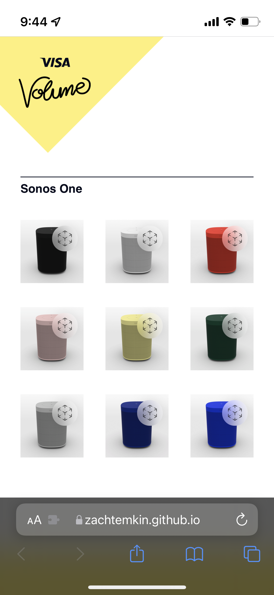
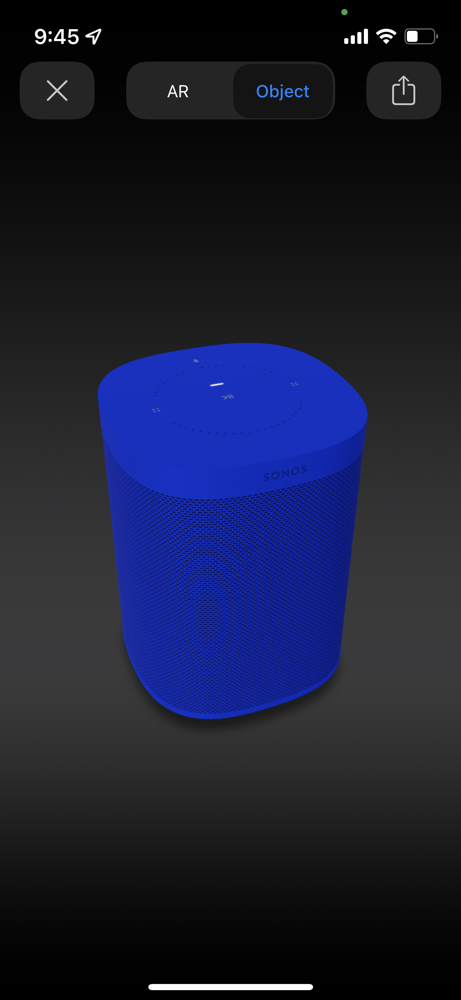

<MdxLayout col='8' offset='4'>

---

I had just watched WWDC where Apple announced support for viewing .usdz files in AR natively. I took this as an opportunity to create a quick and easy to implement AR retail experience.

I molded a Sonos speaker in blender and rendered it out as a .usdz file with several different materials in different colors. I built a simple website to host these files, and because of the native iOS support, these items could then be viewed in AR.

We used this demo on the tour for the next year, and clients were always surprised and delighted by the ‘magic’ of AR.

</MdxLayout>

<MdxLayout col='4'>

</MdxLayout>

<MdxLayout col='4'>

</MdxLayout>

<MdxLayout col='4'>

</MdxLayout>

<MdxLayout col='4'>

</MdxLayout>

<MdxLayout col='4'>

</MdxLayout>
