---

<MdxLayout col="8" offset="0">

## Doors of Troy

#### 2014

Inspired by "Windows of New York", and in an effort to become proficient in Adobe Illustrator, I decided to illustrate the beautiful victorian era doors on the buildings in Troy, NY, where I went to school.

I also built a simple website to showcase the illustrations.

  <a href='http://zachtemkin.github.io/lab/door' target='_blank'>
    See the live project here
  </a>

</MdxLayout>

<MdxLayout col='4' offset='0'>
  {/* intentionally left blank */}
</MdxLayout>

<MdxLayout col="4" offset="0">

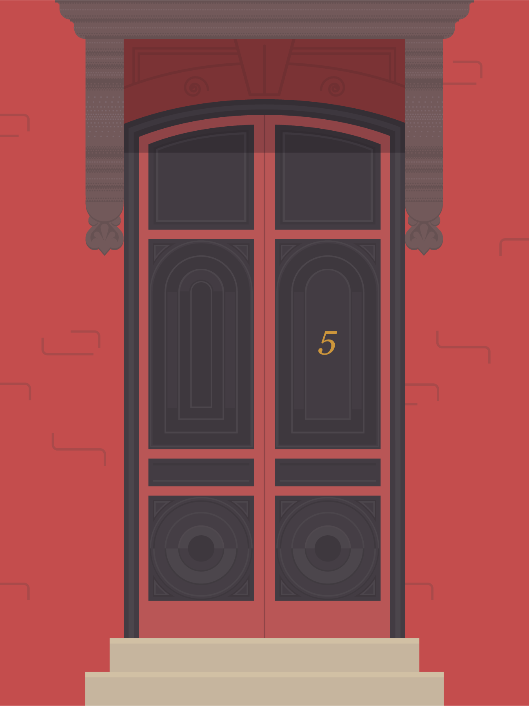

</MdxLayout>

<MdxLayout col="4" offset="0">

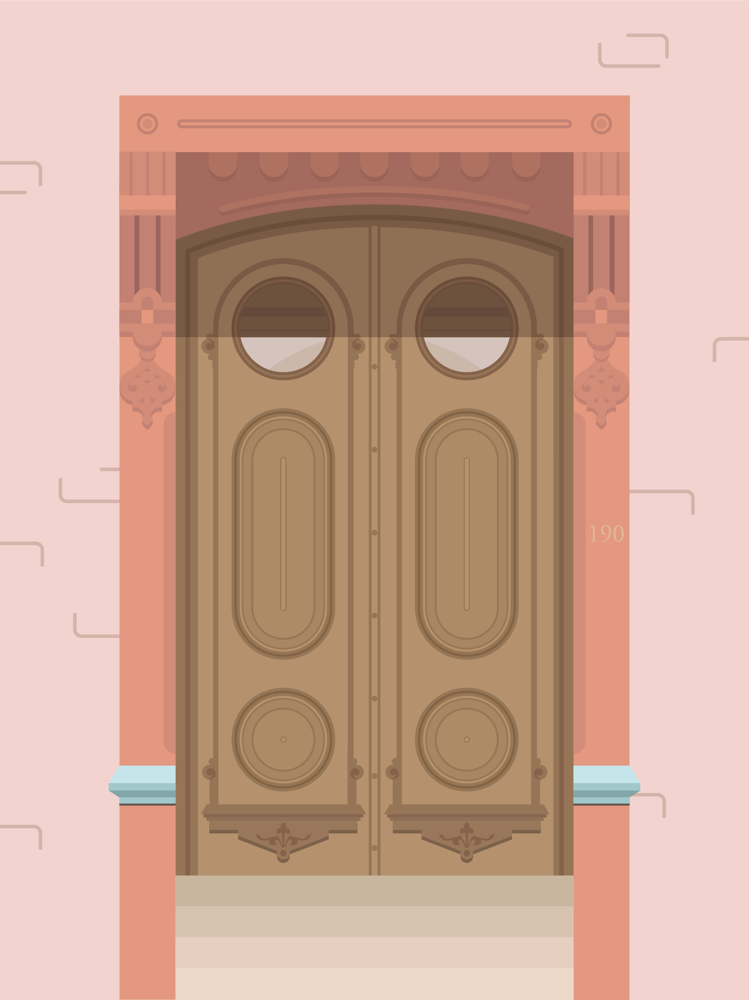

</MdxLayout>

<MdxLayout col="4" offset="0">

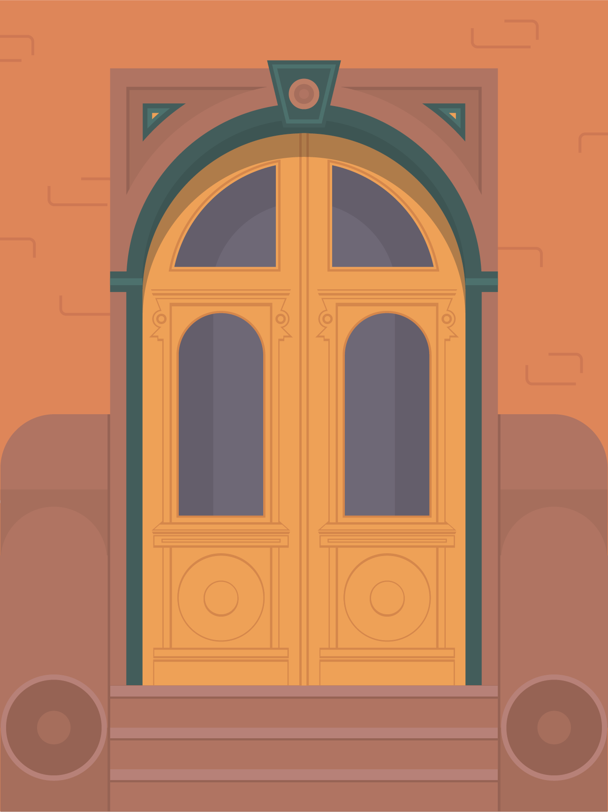

</MdxLayout>

<MdxLayout col="4" offset="0">

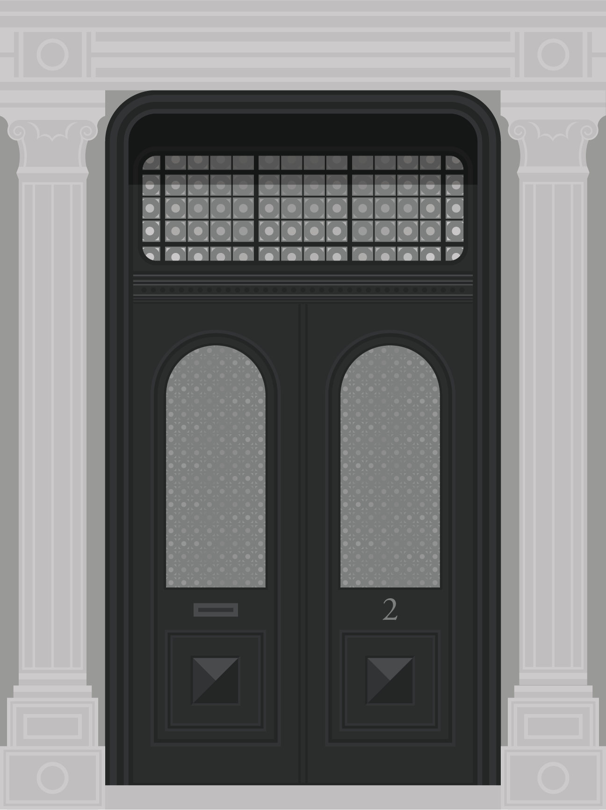

</MdxLayout>

<MdxLayout col="4" offset="0">

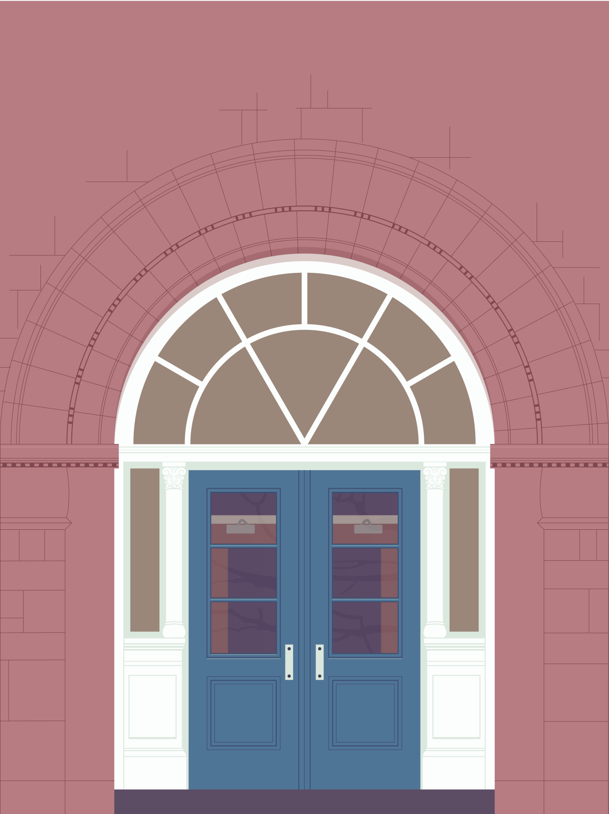

</MdxLayout>

---

<MdxLayout col="12" offset="0">

## Landscapes

#### 2014 - 2015

</MdxLayout>

<MdxLayout col='12' offset='0'>
  {/* intentionally left blank */}
</MdxLayout>

<MdxLayout col="7" offset="0">

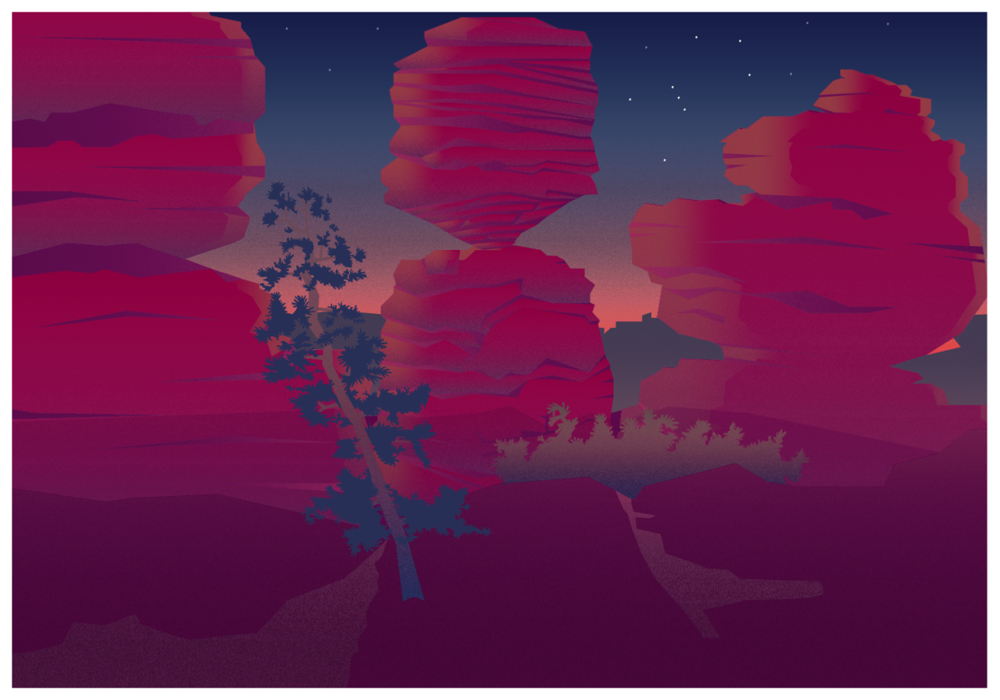

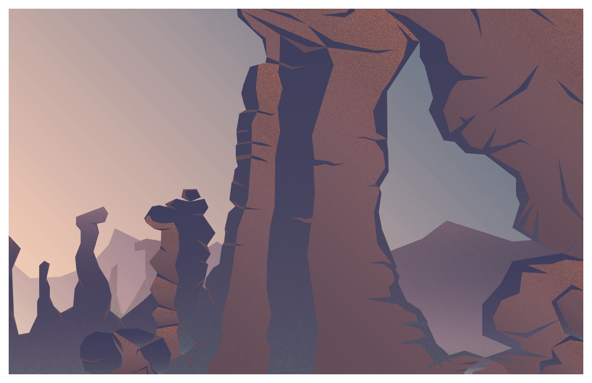

</MdxLayout>

<MdxLayout col="5" offset="0">

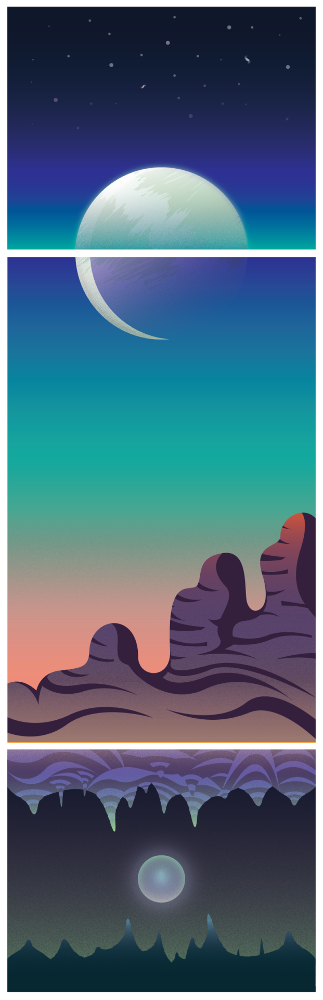

</MdxLayout>

---

<MdxLayout col="12" offset="0">

## Architectural Illustrations

#### 2014 - 2015

</MdxLayout>

<MdxLayout col="6" offset="0">

</MdxLayout>

<MdxLayout col="6" offset="0">

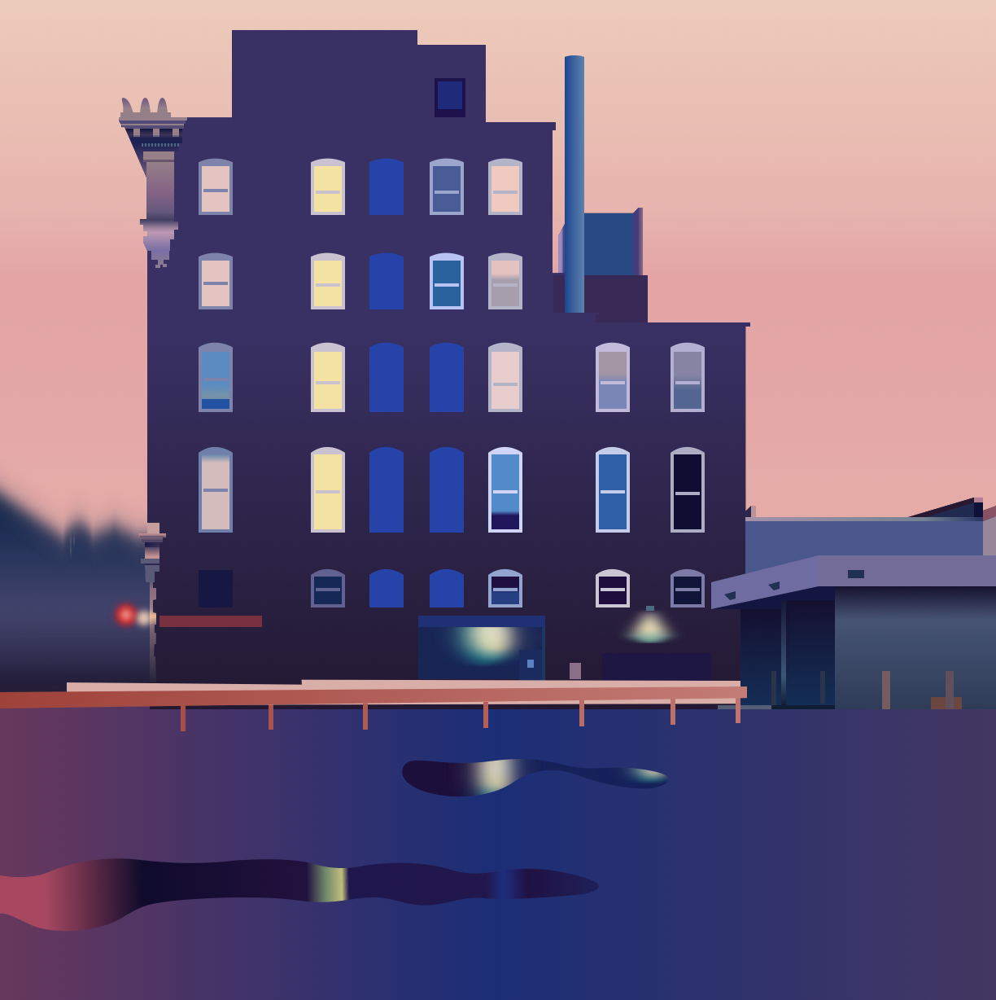

</MdxLayout>

<MdxLayout col="6" offset="0">

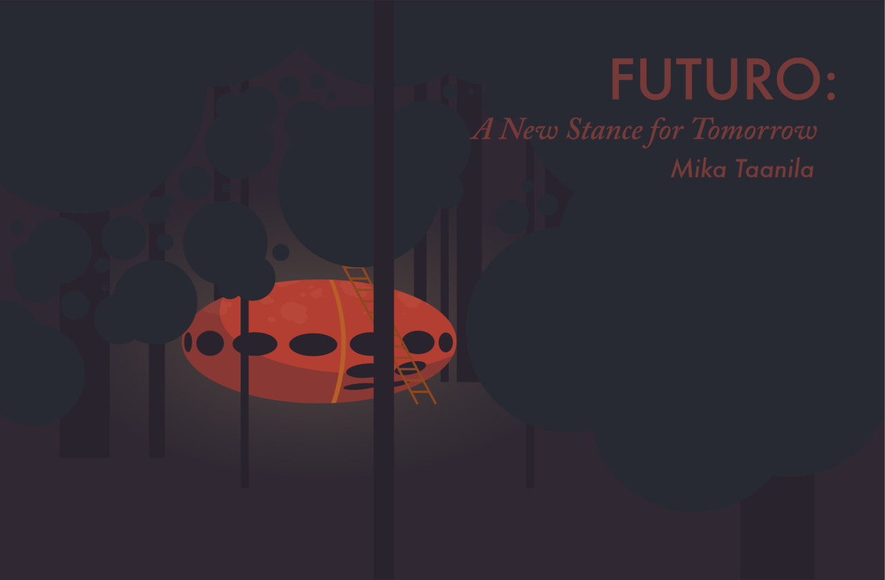

</MdxLayout>

<MdxLayout col="6" offset="0">

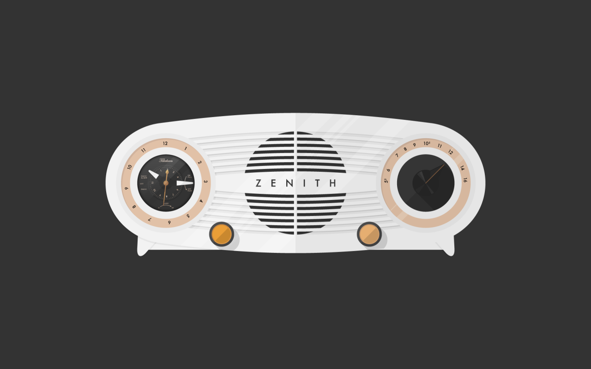

</MdxLayout>

<MdxLayout col="6" offset="0">

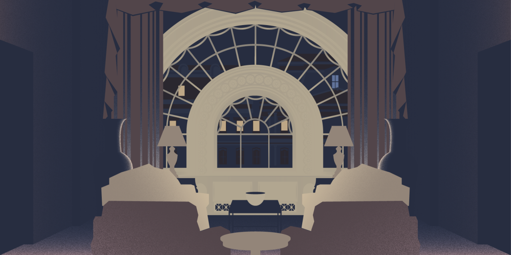

</MdxLayout>

---

<MdxLayout col="12" offset="0">

## Miscellaneous

#### 2015 - 2017

</MdxLayout>

<MdxLayout col="6" offset="0">

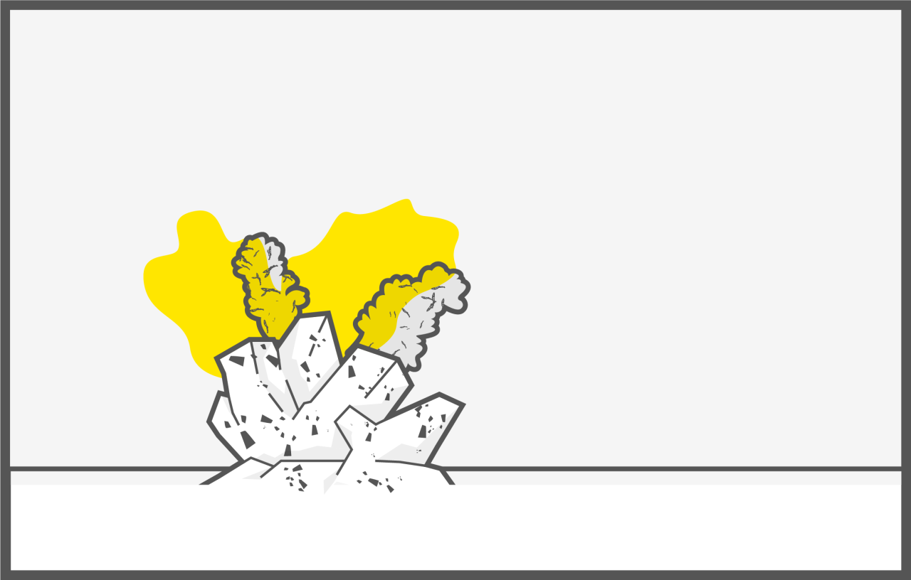

</MdxLayout>

<MdxLayout col="6" offset="0">

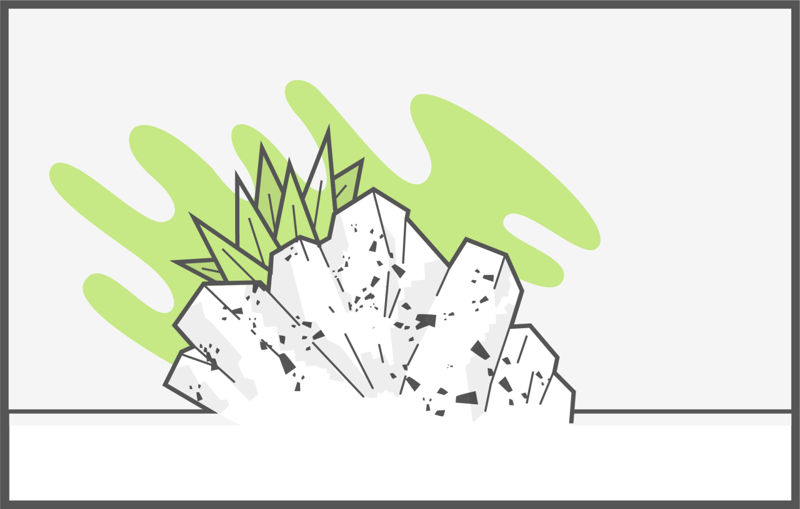

</MdxLayout>

<MdxLayout col="6" offset="0">

</MdxLayout>

<MdxLayout col="6" offset="0">

</MdxLayout>

<MdxLayout col="6" offset="0">

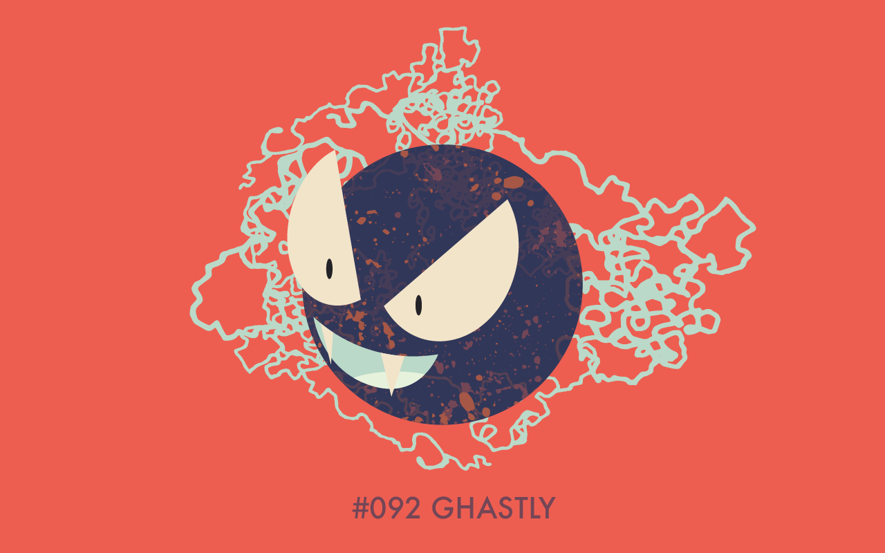

</MdxLayout>

<MdxLayout col="6" offset="0">

</MdxLayout>
