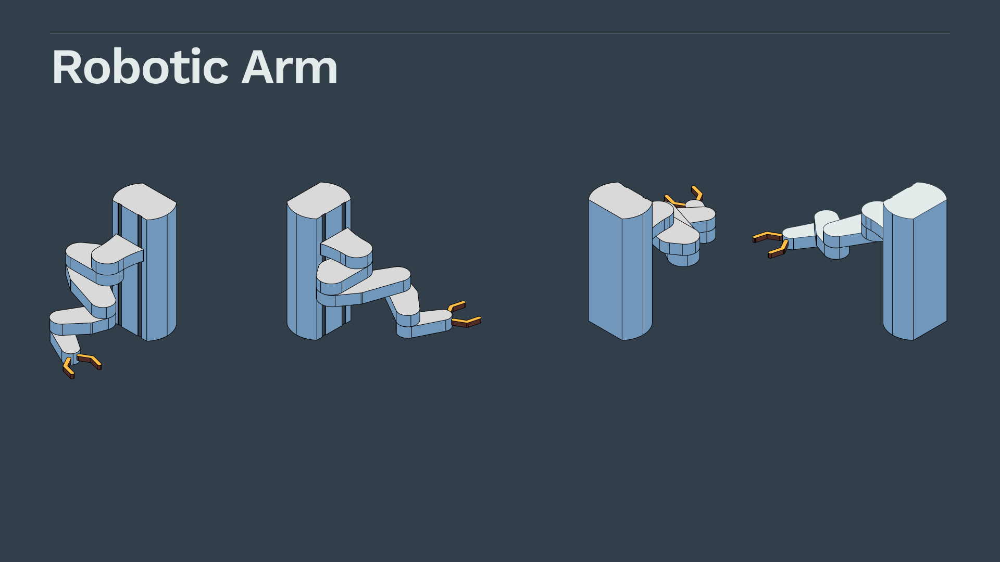
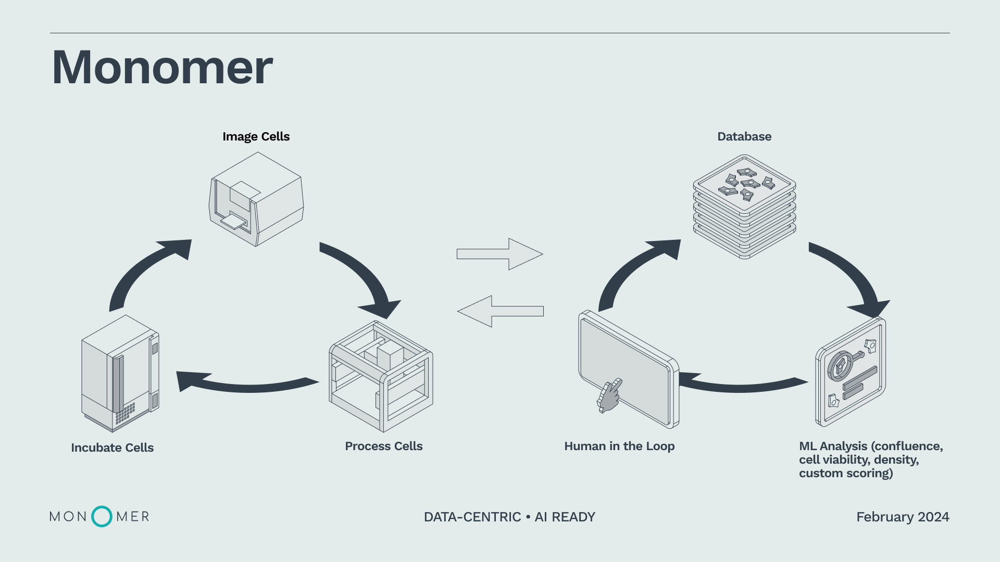

<MdxLayout col='8' offset='4'>

Monomer is an early stage startup that makes software that helps scientists automoate lab experiments. They needed help creating assets to easily explain their value prop to potential customers and also wanted to refresh their visual identity. I developed a visual framework to help break down and explain the different pillars of their business in a clear and visually compelling way.

</MdxLayout>

<MdxLayout col='12' offset='0'>

---

## Communication Strategy

</MdxLayout>

<MdxLayout col='10' offset='2'>

</MdxLayout>

<MdxLayout col='12' offset='0'>

---

## Visual System

</MdxLayout>

<MdxLayout col='10' offset='2'>

</MdxLayout>

<MdxLayout col='12' offset='0'>

---

## Application Examples

</MdxLayout>

<MdxLayout col='5' offset='2'>

</MdxLayout>

<MdxLayout col='5' offset='0'>

</MdxLayout>

<MdxLayout col='5' offset='2'>

</MdxLayout>

<MdxLayout col='5' offset='0'>

</MdxLayout>

<MdxLayout col='10' offset='2'>

---

### Monomer "Stack"

</MdxLayout>

<MdxLayout col='5' offset='2'>

</MdxLayout>

<MdxLayout col='5' offset='0'>

</MdxLayout>

<MdxLayout col='5' offset='2'>

</MdxLayout>

<MdxLayout col='5' offset='0'>

</MdxLayout>

<MdxLayout col='10' offset='2'>

---

### System Diagrams

</MdxLayout>

<MdxLayout col='10' offset='2'>

</MdxLayout>
