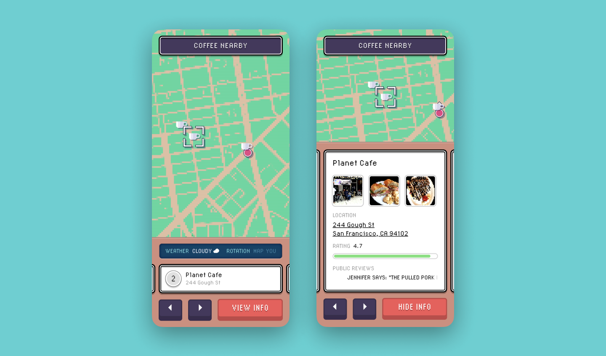
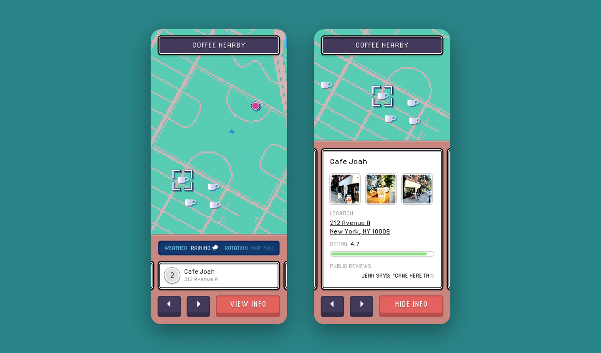
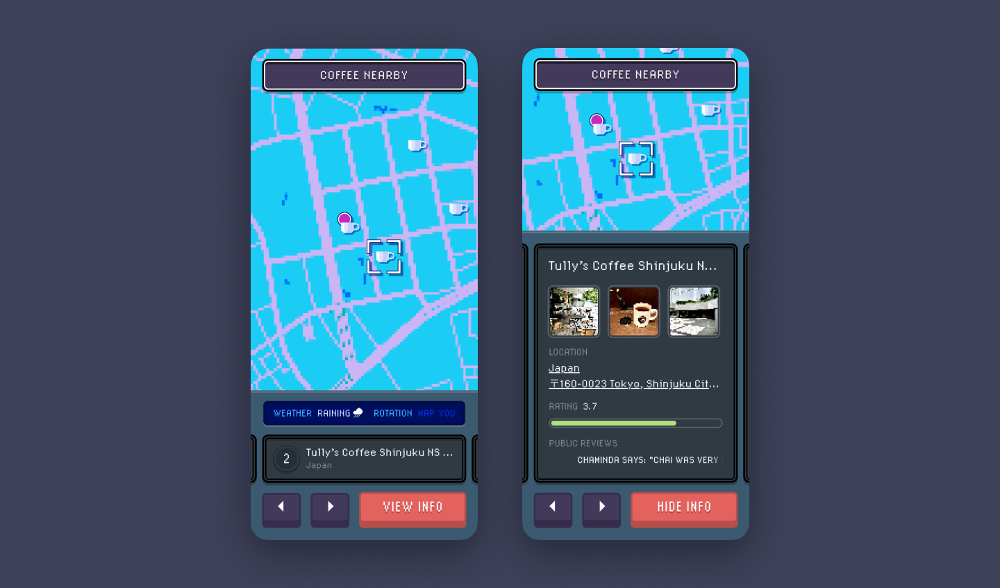

---

<MdxLayout col="10" offset="0">

## Nearby Land

  <a
    className='live-project-link'
    href='http://coffee.nearby.land'
    target='_blank'>
    See the live project here &rarr;
  </a>

Inspired by Nintendo consoles, and the Pokémon video games, the user interface is designed to mimic a hardware device without a touchscreen, so all interactions happen by tapping simulated phyiscal buttons. Using the arrow buttons, the user can browse different places in the area and tap the details button to view more information.

The color scheme of the app changes subtly with the weather, and there is a dark theme for night time.

Future iterations would include the ability to search for places and things other than coffee.

</MdxLayout>

<MdxLayout col="12" offset="0">

</MdxLayout>

<MdxLayout col="12" offset="0">

</MdxLayout>

<MdxLayout col="12" offset="0">

</MdxLayout>
