<MdxLayout col="8" offset="0">

## Selected Paintings

</MdxLayout>

<MdxLayout col="6" offset="0">

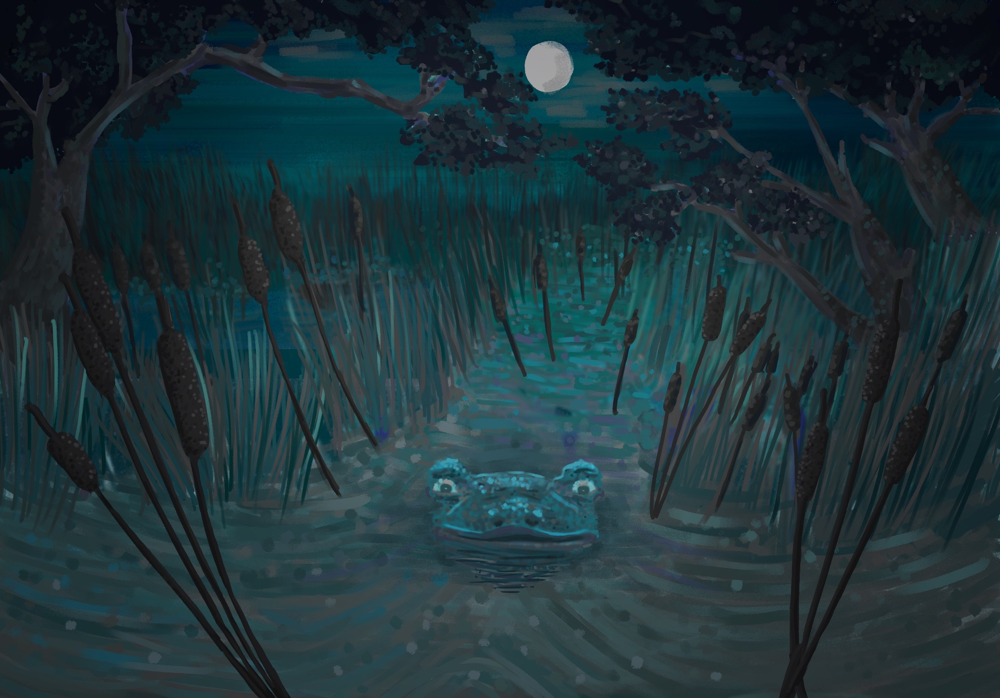

</MdxLayout>

<MdxLayout col="6" offset="0">

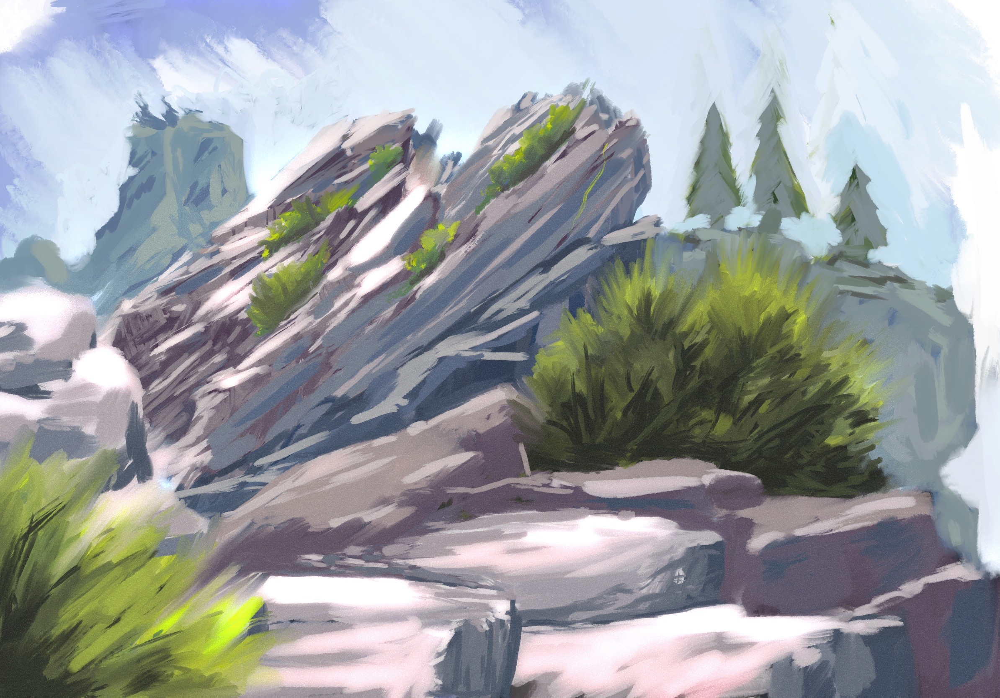

</MdxLayout>

<MdxLayout col="6" offset="0">

</MdxLayout>

<MdxLayout col="6" offset="0">

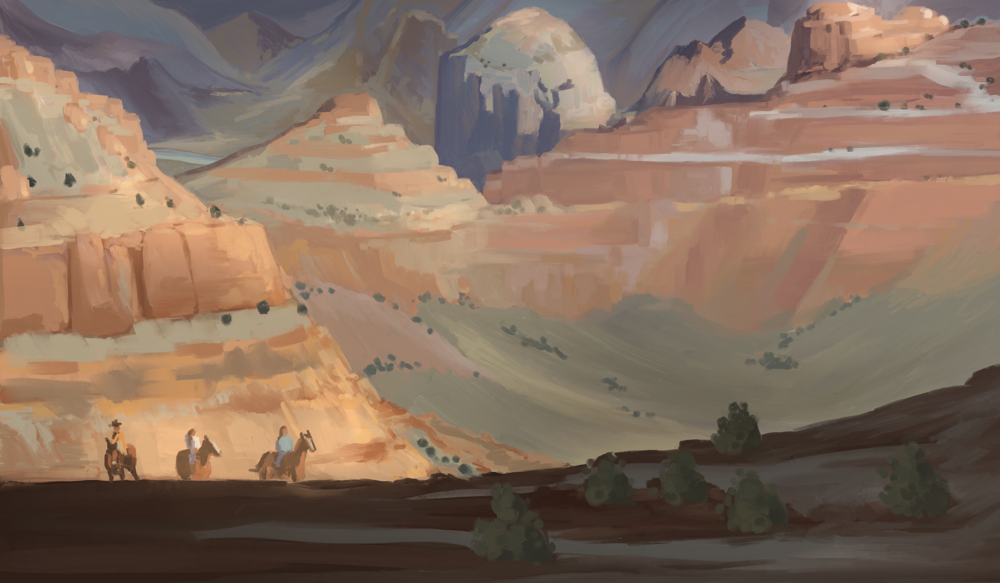

</MdxLayout>

<MdxLayout col="6" offset="0">

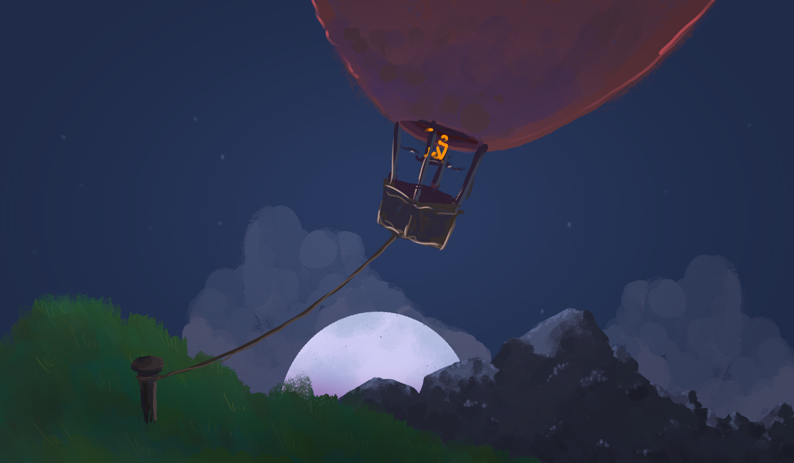

</MdxLayout>

<MdxLayout col="6" offset="0">

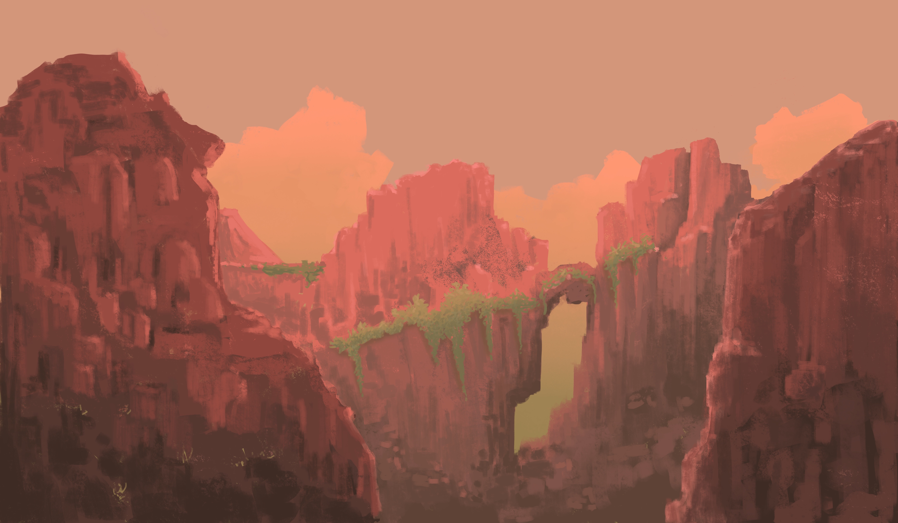

</MdxLayout>

<MdxLayout col="6" offset="0">

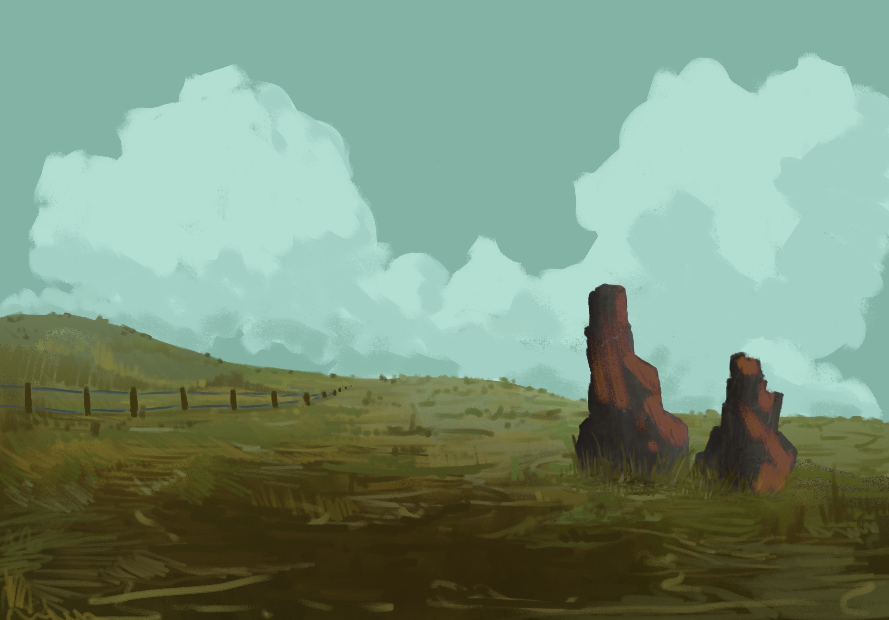

</MdxLayout>

<MdxLayout col="6" offset="0">

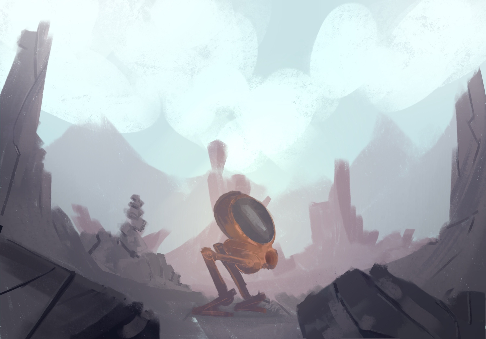

</MdxLayout>

<MdxLayout col="6" offset="0">

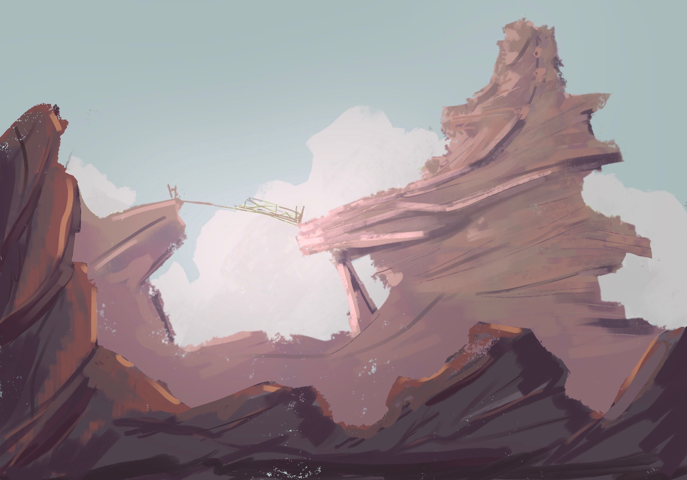

</MdxLayout>

<MdxLayout col="6" offset="0">

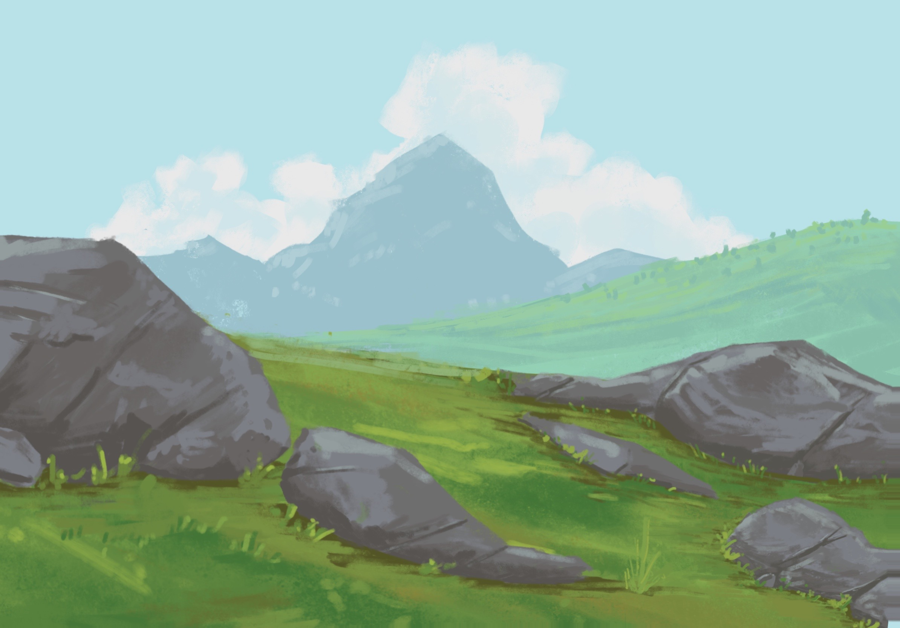

</MdxLayout>

<MdxLayout col="6" offset="0">

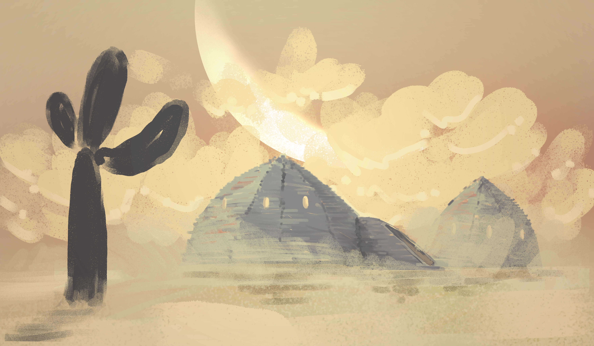

</MdxLayout>

<MdxLayout col="6" offset="0">

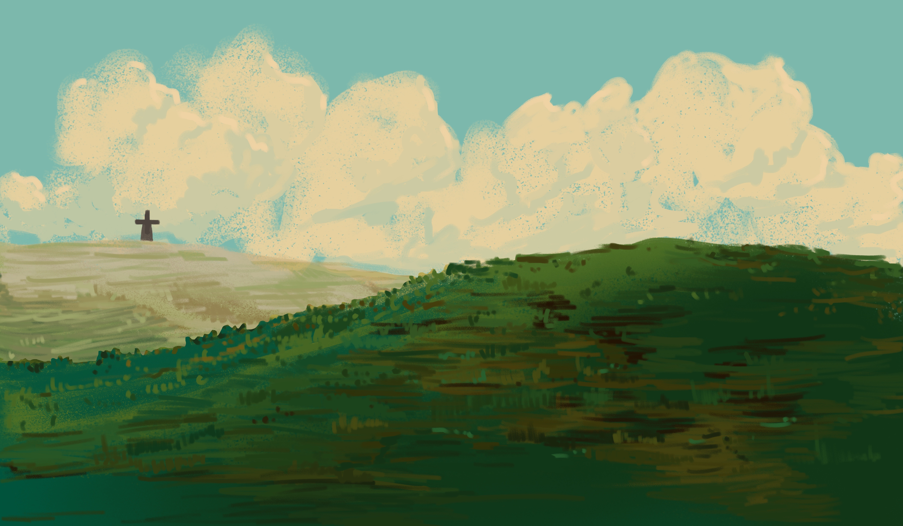

</MdxLayout>

<MdxLayout col="6" offset="0">

</MdxLayout>

<MdxLayout col="6" offset="0">

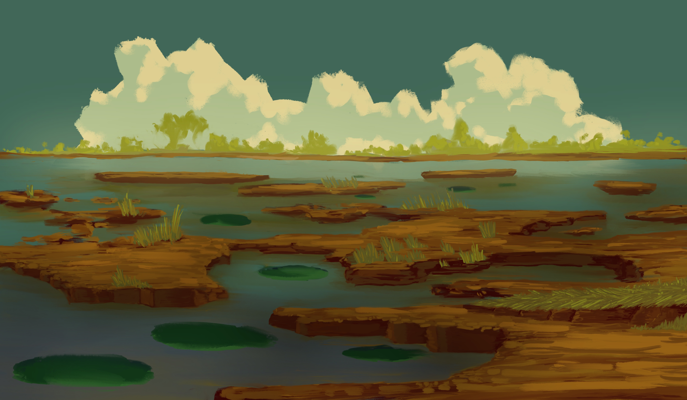

</MdxLayout>

<MdxLayout col="6" offset="0">

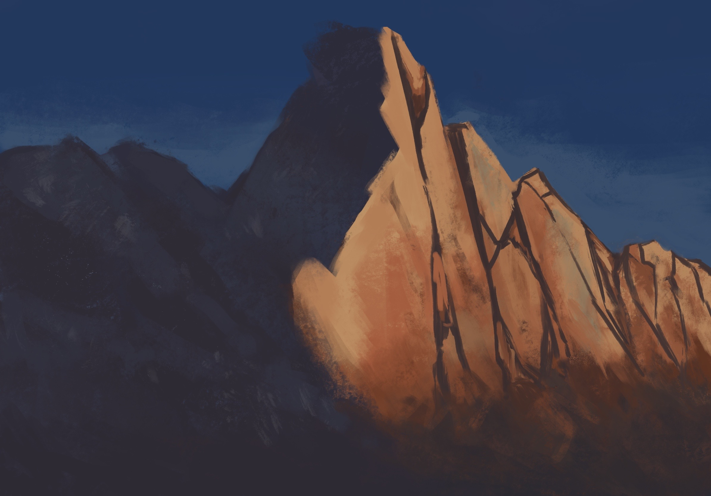

</MdxLayout>
