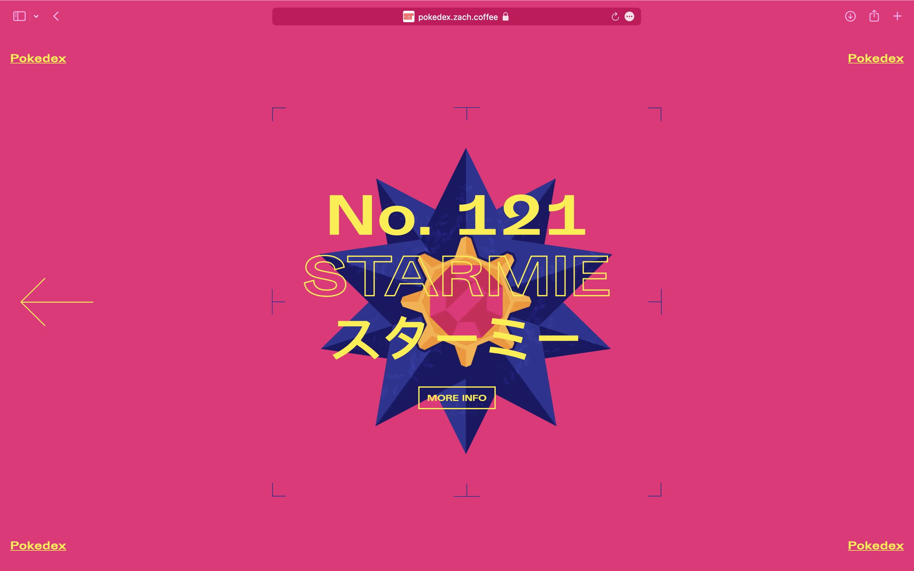

---

<MdxLayout col="8" offset="0">

## Pokedex

  <a
    className='live-project-link'
    href='http://pokedex.zach.coffee'
    target='_blank'>
    See the live project here &rarr;
  </a>

</MdxLayout>

<MdxLayout col="6" offset="0">

</MdxLayout>

<MdxLayout col="6" offset="0">

</MdxLayout>

<MdxLayout col="6" offset="0">

</MdxLayout>

<MdxLayout col="6" offset="0">

</MdxLayout>

<MdxLayout col="6" offset="0">

</MdxLayout>

<MdxLayout col="6" offset="0">

</MdxLayout>
