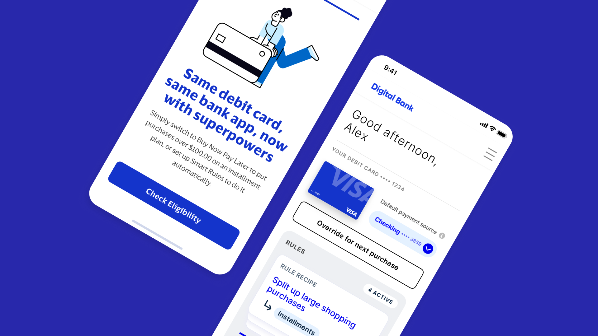

<MdxLayout col='8' offset='4'>

---

### Brief

I was tasked to design a white-labeled experience to envision a new type of payment product, the [Flex Credential](https://usa.visa.com/visa-everywhere/blog/bdp/2024/05/14/one-card-to-1715696707658.html) to use to sell the product to issuers. Ultimately I helped shaped elements of this new product and created assets that were instrumental in bringing this concept to fruition with key clients.

</MdxLayout>

<MdxLayout col='12' offset='0'>

---

## Designs

</MdxLayout>

<MdxLayout col='8' offset='4'>

#### Notification

</MdxLayout>

<MdxLayout col='8' offset='4'>

Alex receives an email from Insurance Co. telling her that her claims have been approved and she has 2 payouts available.

</MdxLayout>

<MdxScreenContainer col='8' offset='4' color='#117ACB'>

</MdxScreenContainer>
