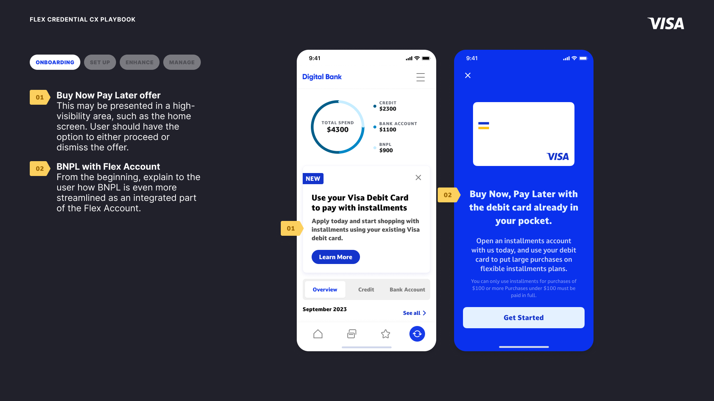

<MdxLayout col='8' offset='4'>

Driven in part by recent growth in adoption of BNPL products, product and tech teams had been exploring the idea of a new type of Visa card that could give a cardholder access to a BNPL plan or a new line of credit on top of their existing bank account. My team was brought in to help shape the vision of this product, and ultimately create a “CX Playbook” that could be used to accelerate clients’ (issuers and fintechs) implementation of this new product. Currently this product is live in Japan as SMBC’s [Olive Card](https://www.smfg.co.jp/english/gr2023/special/special02/) and in the US with the [Affirm Card](https://www.affirm.com/card)

</MdxLayout>

<MdxLayout col='12' offset='0'>

---

## Shaping the vision

</MdxLayout>

<MdxLayout col='8' offset='4'>

At the start of the project there were many stakeholders from different parts of the business with many different ideas about how this product could come to life, what features it should have, and how to message it to consumers. I facilitated several workshops and meetings to help the broader team document and assess everyone’s ideas and ultimately distill those into a set of clear requirements.

There were many moments where stakeholders advocated for decisions that prioritized the status-quo over creating a differentiated product – decisions that would mean less changes to underlying technology or business processes but that would make the product less valuable to end users. However, by quickly creating design artifacts (prototypes, mock-ups, diagrams in FigJam, etc.) to help stakeholders visualize and internalize the potential impacts of these decisions, I was able to successfully advocate for decisions that supported a better user experience.

</MdxLayout>

<MdxLayout col='8' offset='4'>

</MdxLayout>

<MdxLayout col='12' offset='0'>

</MdxLayout>

<MdxLayout col='12' offset='0'>

---

## Onboarding

</MdxLayout>

<MdxLayout col='8' offset='4'>

There are several possible onboarding experiences depending on whether the user's current relationship to the bank and what accounts they might already have open if they are an existing customer.

Ultimately this artifact aims to help clients ensure product adoption with an engaging, informative and simple onboarding process that clearly communicates product features, how to start using them and how to enable long term ‘stickiness’ and engagement.

</MdxLayout>

<MdxLayout col='12' offset='0'>

</MdxLayout>

<MdxLayout col='8' offset='4'>

---

### Onboarding Existing Users

Streamline onboarding by setting clear expectations of effort. Guide users to first select a primary payment method and then add more options. Where there is benefit to the user, cross-sell relevant products and, if possible, enable simple sign-up.

</MdxLayout>

<MdxLayout col='12' offset='0'>

</MdxLayout>

<MdxLayout col='8' offset='4'>

---

### Onboarding New Users

Make it easy for new users to get started with Multi account access, avoid additional steps or ‘off platform’ applications where possible, offer relevant, low complexity products to help users get started.

</MdxLayout>

<MdxLayout col='12' offset='0'>

</MdxLayout>

<MdxLayout col='8' offset='4'>

---

### Onboarding Existing Users In-Flow

For existing users, you may choose to offer Buy Now Pay Later after primary onboarding is complete. If BNPL is not central to your value proposition, this may help to shorten your primary onboarding. It’s also a way to cross-sell BNPL to existing Flex Account users.

</MdxLayout>

<MdxLayout col='12' offset='0'>

</MdxLayout>

<MdxLayout col='8' offset='4'>

---

### Onboarding Carousel

Whether Buy Now Pay Later is offered during or after the primary onboarding, set clear expectations for repayment. If there are multiple repayment options, explain each one clearly. Also, explain how BNPL is seamlessly integrated into their Flex Account.

</MdxLayout>

<MdxLayout col='12' offset='0'>

</MdxLayout>

<MdxLayout col='8' offset='4'>

---

### Application

Once you have introduced and explained Buy Now Pay Later to the user, it’s time to start the application process. Once the user has completed primary onboarding, they can onboard to BNPL simply by checking eligibility and, if repayment schedule options exist, choosing the one that works best for them

</MdxLayout>

<MdxLayout col='12' offset='0'>

</MdxLayout>

<MdxLayout col='12' offset='0'>

---

## Set-Up

</MdxLayout>

<MdxLayout col='8' offset='4'>

Flex Account offers some new and unique capabilities and it is important to provide an intuitive and simple process for customers interacting with the product for the first time.

---

### Setting Default Payment Method

The user can configure the default payment method of their Flex card to Debit, Credit, Prepaid or BNPL(Buy Now Pay Later). This control applies to all online and in-store transactions, unless a One-Time Override or Smart Rule has been applied. The user may change the default payment method of their Flex card at any time.

</MdxLayout>

<MdxLayout col='12' offset='0'>

</MdxLayout>

<MdxLayout col='8' offset='4'>

---

### "Smart Rules" Overview

Participating issuers can combine Smart Rules to further maximise the capabilities, helping users achieve their financial goals through effective management or spending or to help support significant spending events such as travel.

To help manage spending, a user can define Smart Rules to automate how they want to pay with their card. When the user makes an online or offline purchase, the rule will be automatically applied to the transaction if that transaction meets the pre-defined criteria.

utimate payment method decisions upfront so that the user can feel confident using their card and begin utilising the feature immediately and often.

</MdxLayout>

<MdxLayout col='12' offset='0'>

</MdxLayout>

<MdxLayout col='8' offset='4'>

---

### "Smart Rules" Approach

Participating issuers can offer Smart Rules with different levels of sophistication, balancing the needs and preferences of different user types with issuers’ available resources and capabilities.

For example, Smart Rules can be as simple as offering a single rule type with a single adjustable setting. Building on this, issuers can choose to offer multiple rule types, either in a fixed or customizable order of precedence.

Smart Rules can even be abstracted behind relatable financial goals or modes, powered by interconnected rule sets that issuers define in advance, or even by artificial intelligence (AI).

Offer the Smart Rules approach that is most helpful to your users so they feel empowered while using their card and use rules to automate their financial needs and preferences.

</MdxLayout>

<MdxLayout col='12' offset='0'>

</MdxLayout>

<MdxLayout col='8' offset='4'>

---

### Amount-Based Rules

Automate payment method by defining Smart Rules based on the transaction amount.
For example, a rule to always use Credit for payments over $100.

</MdxLayout>

<MdxLayout col='12' offset='0'>

</MdxLayout>

<MdxLayout col='8' offset='4'>

---

### Merchant Category Rules

Automate payment method by defining Smart Rules based on the transaction amount.
For example, rule to always use Credit for payments over $100.

</MdxLayout>

<MdxLayout col='12' offset='0'>

</MdxLayout>
