<MdxLayout col="8" offset="4">

### Problem

The client team had a hypothesis that small business owners were struggling to achieve long-term success because they lacked foundational knowledge in financial planning, business development, and marketing.

Existing products and programs aimed at filling these gaps were either too specific or too general, and small business owners were overwhelmed with choice as what material to engage with.

### Objectives

- Build a deeper understanding of the needs of the target Small Business customer
- Determine what content would resonate with the target segment
- Determine how to design a user experiences that would drive highest engagement with the content
- Develop a content strategy for the Small Business Academy, design an MVP experience, and provide an execution roadmap

### Responsibilities

My manager and I represented Design on the Visa project team.

I was responsible for :

- The design of a discovery workshop with the client to set project scope
- Leading qualitative research into small business owner's
- Directing an outside research agency on a quantitative survey of Small Business owners
- Designing an MVP experience, and concept testing with small business owners

My manager provided creative direction, workshop facilitation support, and managed the client relationship.

I also worked closely with members of our consulting and analytics team to understand the needs and constraints of the client's business. The consulting team was also able to surface aggregated, anonymized VisaNet data about this particular user base that I used to help inform various design decisions.

### Timeline

#### 6 Weeks

We broke the project into three, 2-week phases: Discovery, Research, and Prototyping. During each phase I had to present key updates to a sub-set of the client team. At the end of each phase was a larger meeting with a steering committee.

### Deliverables

Ultimately, our deliverable was a "playbook" document, detailing key insights found from research, a market landscape analysis, content strategy for the Small Business Academy, designs for an MVP web experience, and an execution roadmap.

</MdxLayout>

---

<MdxLayout col="4" offset="0">

## Discovery

</MdxLayout>

<MdxLayout col="8" offset="0">

My first task was to design a discovery workshop to help the team refine and align on the problem definition, scope, and goals. Specifically, we need to align on a few key areas: audience, channels, content, and revenue.

### Stakeholder Interviews

In preparation for the workshop, I conducted stakeholder interviews to see where the client team might have had any internal ambiguity or clarity, alignment or misalignment. I also wanted to surface areas that people were most excited about, and most concerned about.

### Workshop Agenda

My main goal for the workshop was to make sure that all of the assumptions and hypotheses I uncovered during the stakeholder interviews were surfaced and discussed. Any alignment that could be achieved would narrow the scope, and any misalignment would provide us with rich objectives for our research phase.

I selected a few key activities to help reach these goals:

- Discuss findings from stakeholder interviews through the framework of “fact finding questions”
- Collectively fill out a “Project Radar” canvas
- Collectively map our hypothesis on questions of audience, channels, content, and revenue

</MdxLayout>

<MdxLayout col="12" offset="0">

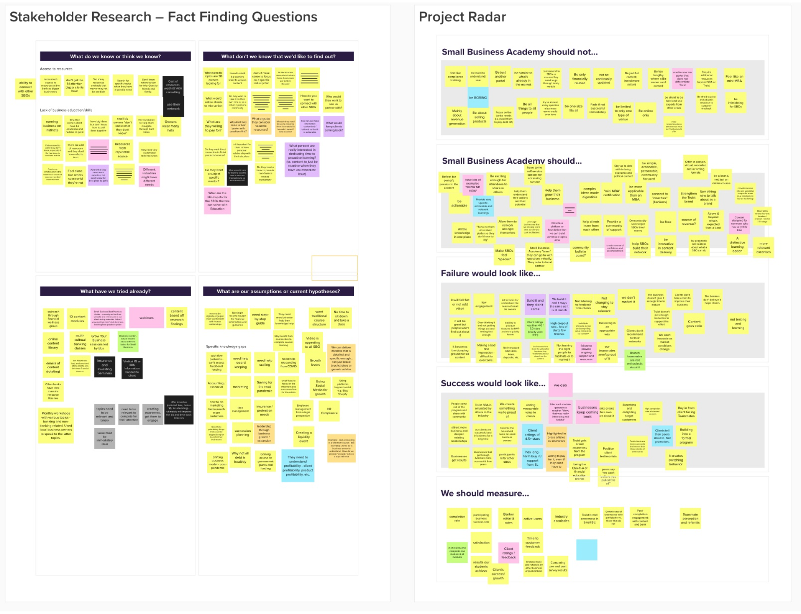

</MdxLayout>

<MdxLayout col="8" offset="4">

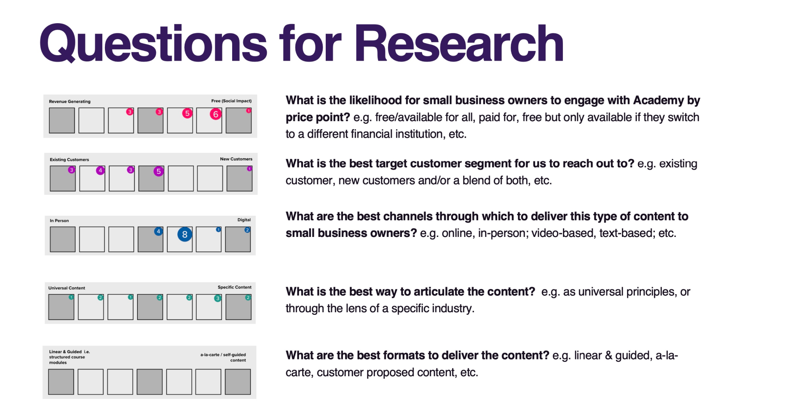

### Discovery Outcomes

The team was generally aligned in their assumption that small business owners were overwhelmed by too many resources online, didn't get enough personalized attention from big banks, and that most lacked formal business education.

There was a bit of divergence around what specific topics small business owners needed the most help with.

There was a general consensus that we needed to do more to figure out what channels and form factors business owners would be most likely to engage with.

After the session, I worked with my manager and the Visa consulting team to synthesize our purpose, vision, and goals for the project, and began crafting a qualitative research study to begin testing our assumptions and exploring possible solutions.

</MdxLayout>

<MdxLayout col="12" offset="0">

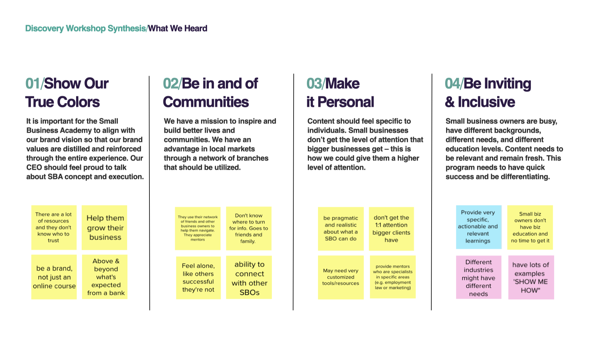

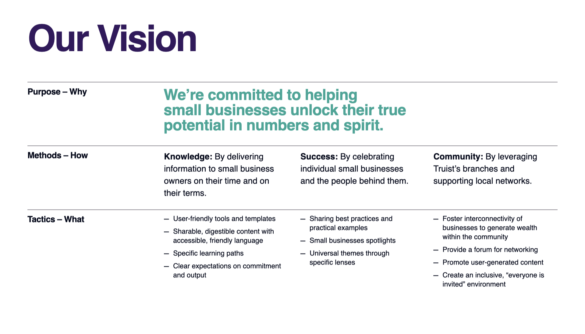

</MdxLayout>

<MdxLayout col="6" offset="0">

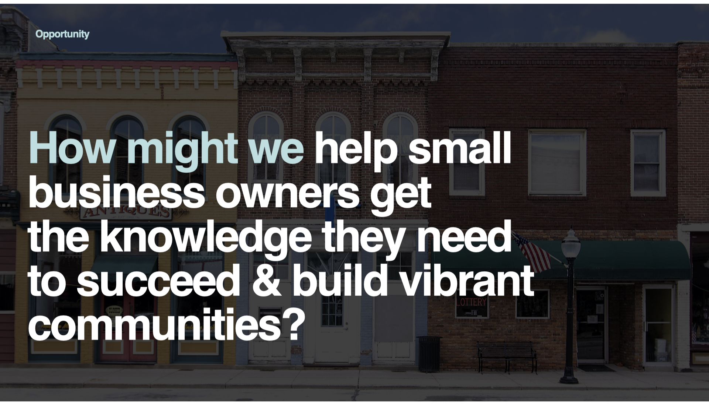

</MdxLayout>

<MdxLayout col="6" offset="0">

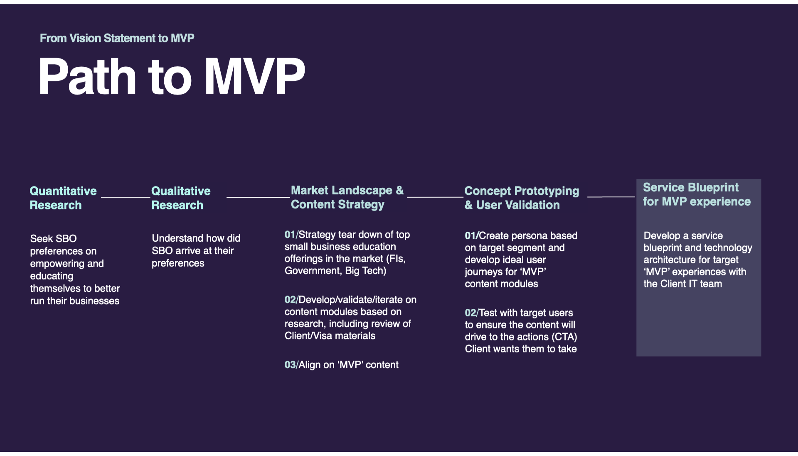

</MdxLayout>

---

<MdxLayout col="4" offset="0">

## Research

</MdxLayout>

<MdxLayout col="8" offset="0">

I drafted a discussion guide for an hour long in-depth interview with a small business owner to discover how they approach learning today, how they consume content, and which foundational knowledge areas they feel strong or weak in (e.g. accounting, business planning, marketing)

I used the d-scout platform to recruit and conduct interviews with 16 small business owners. my manager and other members of the project team took notes.

I also worked with an outside agency to design a survey that went out to 500 small business owners to get a better understanding of the foundational knowledge areas they found most valuable.

I then lead the synthesis of this research along with my manager, and built a deck outlining our key findings.

### Key Findings

</MdxLayout>

<MdxLayout col="8" offset="4">

#### How small business owners approach learning today:

</MdxLayout>

<MdxLayout col="12" offset="0">

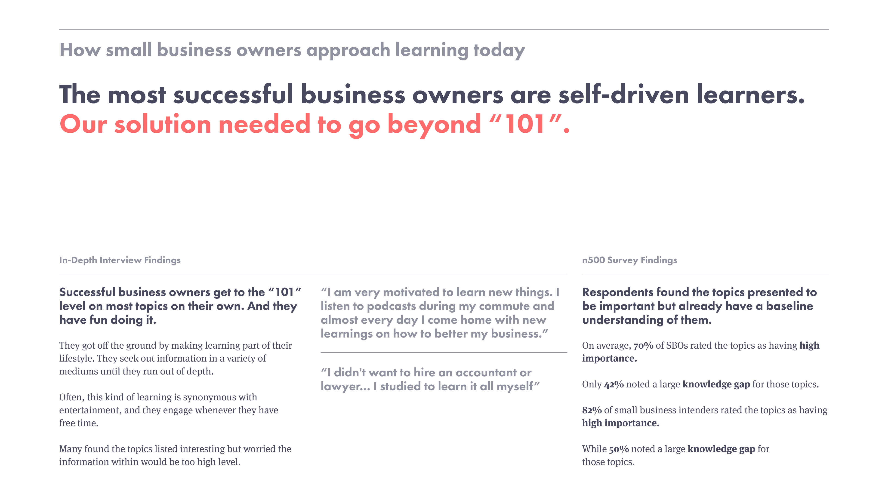

</MdxLayout>

<MdxLayout col="12" offset="0">

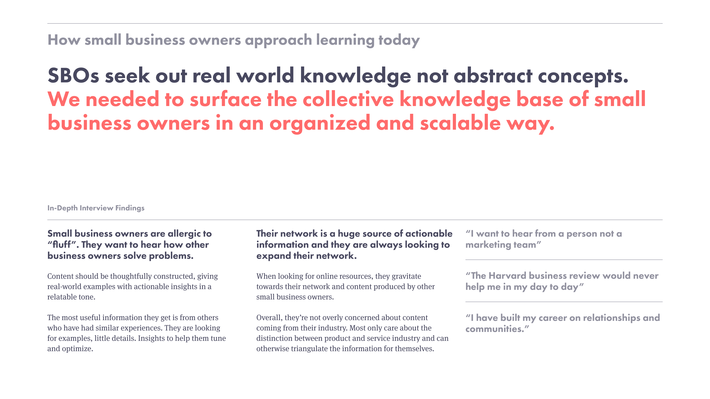

</MdxLayout>

<MdxLayout col="12" offset="0">

#### How small business owners consume content:

</MdxLayout>

<MdxLayout col="12" offset="0">

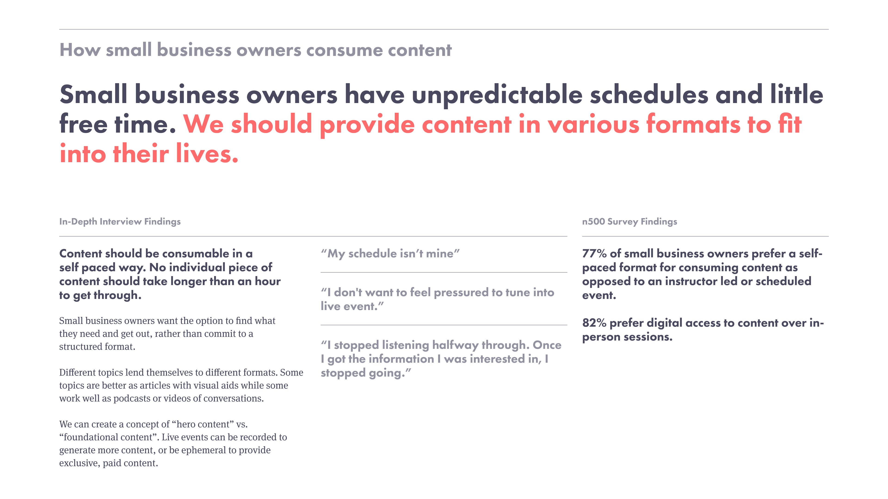

</MdxLayout>

---

<MdxLayout col="4" offset="0">

## Design

</MdxLayout>

<MdxLayout col="8" offset="0">

### Content Strategy

A key insight from research was that small business owners want to hear directly from other business owners. I envisioned a concept of “hero content” which could include featured stories or interviews with local business owners. Sourcing or producing this kind of content is challenging but would be a huge differentiator for the product.

One way to generate this hero content would be to record an in-person panel or interview session. By hosting local networking events and recording them, the bank could solve two for two needs at once.

The site could have featured hero content, and then be padded out with articles on more general topics that could be easily sourced or produced by the bank.

</MdxLayout>

<MdxLayout col="12" offset="0">

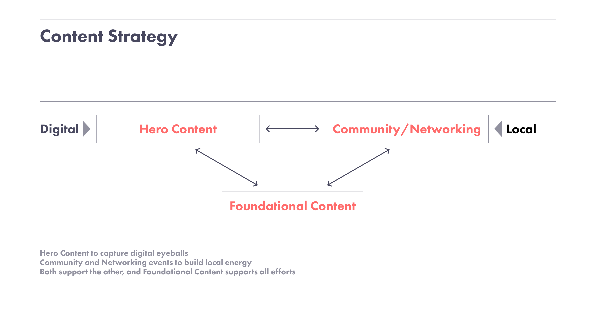

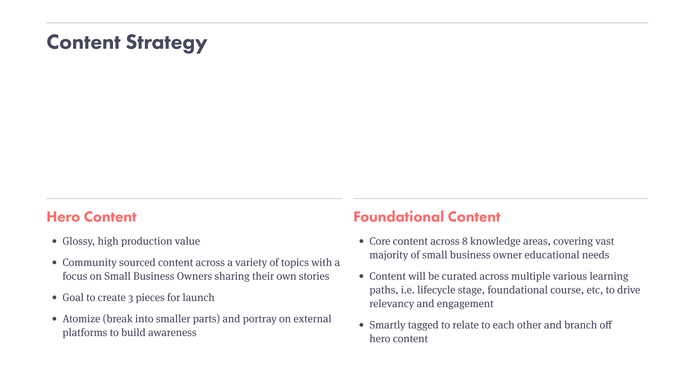

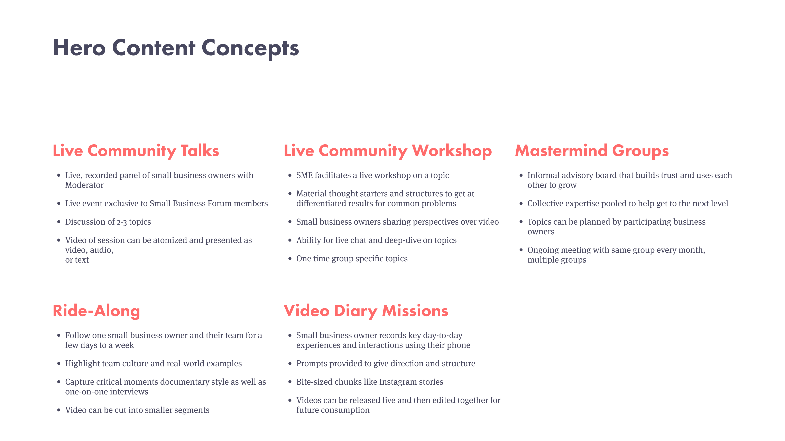

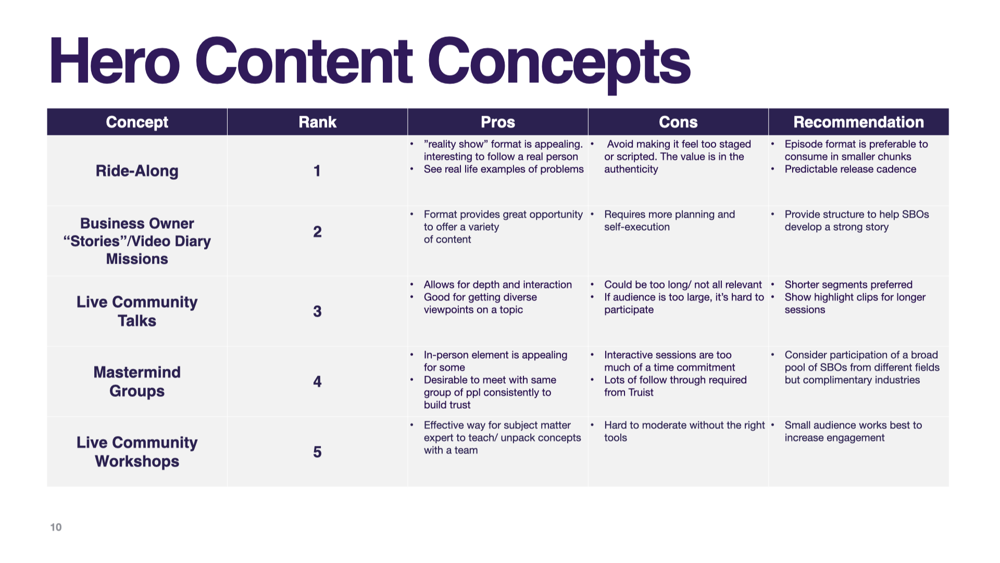

</MdxLayout>

<MdxLayout col="8" offset="4">

### Website Design & Concept Testing

I then had two weeks to develop concepts for a landing page, sign-up flow, user profile, and content pages, to test with users. I based my designs on the bank’s new brand guidelines.

I used D-Scout to conduct 60 min follow-up session with 10 of the participants from our previous round of research where I took them through various concepts I had developed for the site, asking them to do a think-aloud.

</MdxLayout>

<MdxLayout col="12" offset="0">

#### Homepage Concepts (user not signed-up/logged in)

</MdxLayout>

<MdxLayout col="12" offset="0">

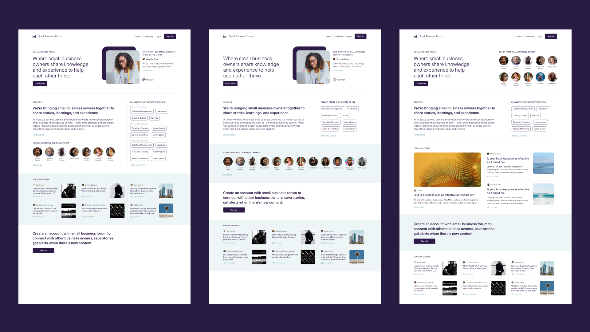

</MdxLayout>

<MdxLayout col="8" offset="4">

> ##### User Feedback
>
> - Organized content makes sense
> - Intrigued by the SBO profile images
> - Feels like it was built for them as a SBO looking to interact with other SBOs
>
> ##### Additional Considerations
>
> - Content filtering, customization to generate content that is relevant to their business
> - Topics should be derived from site interaction
> - It would be nice to see a CTA to connect and collaborate with other SBO

</MdxLayout>

<MdxLayout col="4" offset="0">

#### Sign Up

</MdxLayout>

<MdxLayout col="12" offset="0">

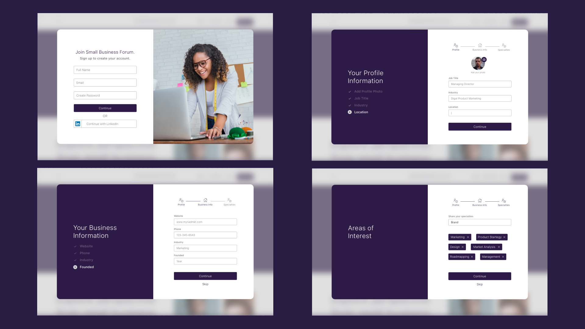

</MdxLayout>

<MdxLayout col="8" offset="4">

> ##### User Feedback
>
> - Concerns about sharing data through sign in with other platforms
> - A reasonable and non-intrusive amount of personal information to share early on
> - Sign up possibly leads to access to all content, and the ability to contribute

</MdxLayout>

<MdxLayout col="4" offset="0">

#### General Profile Setup

</MdxLayout>

<MdxLayout col="12" offset="0">

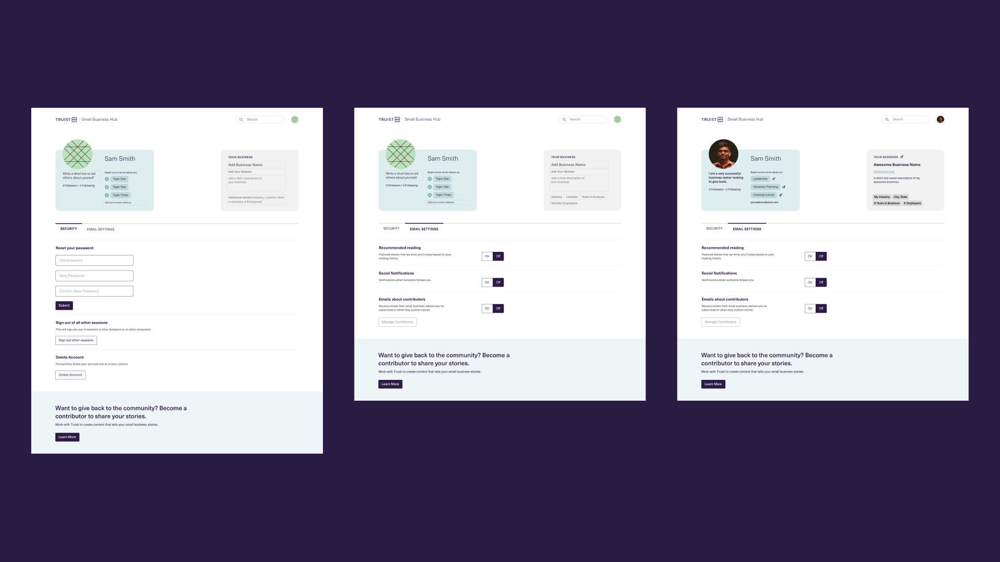

</MdxLayout>

<MdxLayout col="4" offset="0">

#### Creator Profile

</MdxLayout>

<MdxLayout col="12" offset="0">

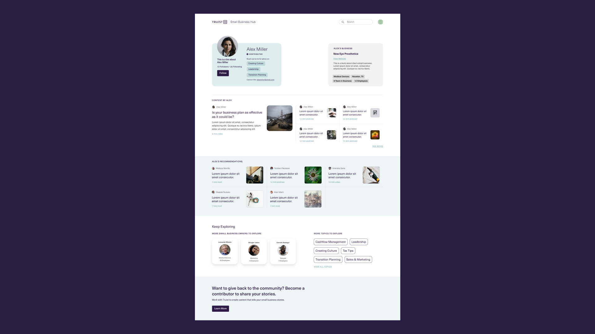

</MdxLayout>

<MdxLayout col="8" offset="4">

> ##### User Feedback
>
> - Content feels structured around a business owner
> - Good to see a snapshot of other people's expertise and contact at the ready and easily Searchable if looking for help
> - Having YOE listed lends credibility
> - Recommendations on content should be personalized and relevant
>
> ##### Additional Considerations
>
> - Connected profile to LinkedIn could be beneficial in providing more professional information and profile legitimacy

</MdxLayout>

<MdxLayout col="4" offset="0">

#### Content Pages

</MdxLayout>

<MdxLayout col="12" offset="0">

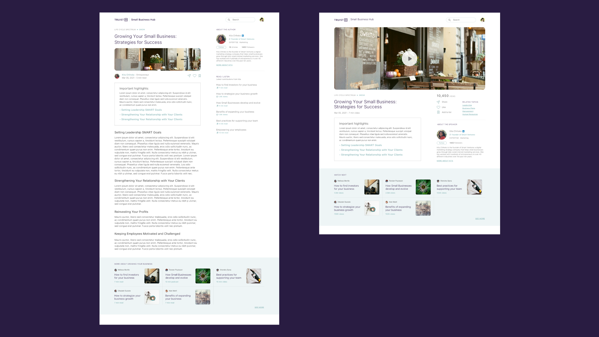

</MdxLayout>

<MdxLayout col="8" offset="4">

> ##### User Feedback
>
> - Cliff notes" helps me determine if I want to go any further in the document
> - This layout makes me want to keep going to find out more
>
> ##### Additional Considerations
>
> - Is contributor sharing information as a peer or are they trying to market something to me?
> - “Learn more” links makes me think I will be spammed by a rep
> - Would be helpful to see a disclaimer to give me the confidence that this page serves as a helpful resource of content

</MdxLayout>
